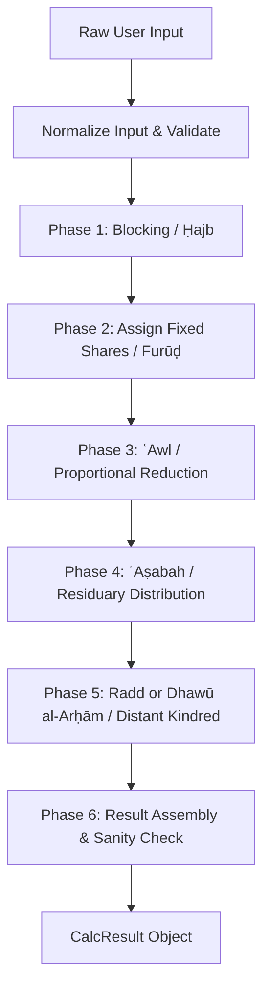

# Farā'iḍ Calculator — System Architecture & Developer Guide

Welcome to the technical architecture guide for the **Farā'iḍ Calculator**. This document provides an architectural overview of the system, module boundaries, calculation pipeline, testing infrastructure, and step-by-step instructions for extending the codebase.

---

## 🏛️ Directory Responsibilities

The codebase follows a modular, decoupled architecture:

```text
src/
├── app/                  # Application bootstrapping & global initialisation
├── core/                 # Shared data types, constants, normalisers, and context builders
├── engine/               # Core multi-phase inheritance calculation engine
├── madhahib/             # School-specific rulesets (Shāfiʿī, Ḥanafī, Mālikī, Ḥanbalī, Jumhūr)
├── features/             # High-level domain features (Munāsakhāt, Calculator UI, Family Tree)
├── math/                 # Exact fraction arithmetic (GCD, LCM, simplified fractions)
├── utils/                # Formatting, key mapping, and display utilities
├── ui/                   # Modular DOM rendering components & view views
└── tests/                # Testing framework (runners, generators, validators, reporters, categories)
```

---

## ⚡ Inheritance Calculation Pipeline

Every inheritance calculation flows through a deterministic 6-phase pipeline orchestrator in `src/engine/calculateInheritance.js`:



### 1. Core Modules (`src/core/`)
- `types.js`: JSDoc type definitions (`HeirsInput`, `ShareEntry`, `CalculationContext`, `CalcResult`).
- `normalizeInput.js`: Maps legacy form field keys (e.g. `brother`) to canonical internal keys (e.g. `fullBrother`).
- `buildContext.js`: Constructs the evaluation flags (`hasDescendants`, `hasFather`, `siblingCount`, disqualifications).

### 2. Math & Fraction Engine (`src/utils/fractions.js`)
All shares are calculated using **exact integer fraction arithmetic** (`{ num, den }`) without IEEE floating-point rounding errors. Operations automatically simplify fractions using the Greatest Common Divisor (GCD).

---

## 🧪 Testing Infrastructure Architecture

The project features an automated testing framework structured into clear single-responsibility sub-directories:

```text
src/tests/
├── runNode.js            # Node CLI entry point (npm test)
├── runBrowser.js         # Browser DOM overlay entry point
├── runBenchmark.js       # Execution speed benchmark runner
├── runner/
│   ├── runAllTests.js    # Suite orchestrator
│   ├── runCategory.js   # Single-category runner
│   ├── testContext.js    # Shared engine dispatcher & key normaliser
│   ├── benchmarkRunner.js# Speed benchmarking engine
│   └── coverageCalculator.js # Category & rule coverage calculator
├── validators/
│   ├── validateEstate.js   # Asserts estate sum ≤ 1
│   ├── validateShares.js   # Asserts non-negative reduced fractions
│   ├── validateBlocking.js # Asserts blocked heirs have zero shares
│   ├── validateAwl.js      # Asserts ʿAwl flags & exact unit sum
│   ├── validateRadd.js     # Asserts Radd redistribution rules
│   └── validateResults.js  # Master validator
├── generators/
│   ├── randomCaseGenerator.js # Seeded PRNG case generator
│   ├── validCaseGenerator.js  # Single/pair/trio coverage generator
│   └── edgeCaseGenerator.js   # Maximum ʿawl, blocking depth, & edge families
├── reports/
│   ├── consoleReporter.js # Terminal output with emoji & coverage bar
│   ├── htmlReporter.js    # Browser overlay panel & test-report.html
│   └── jsonReporter.js    # LocalStorage & test-results.json writer
└── categories/            # 10 domain test suites
```

---

## 🚀 Benchmark & Performance

The engine executes **10,000 full inheritance calculations in under 250 ms** (~40,000 calculations/second).

To run performance benchmarks locally:
```bash
npm run test:benchmark
```

Output:
```text
 ⚡    100 cases :     7.8 ms | 0.0785 ms/case |   12,742 ops/sec
 ⚡  1,000 cases :    31.3 ms | 0.0313 ms/case |   31,959 ops/sec
 ⚡ 10,000 cases :   246.4 ms | 0.0246 ms/case |   40,592 ops/sec

 Performance Rating : Exceptional
```

---

## 🛠️ Developer Extension Guides

### How to Add a Verified Test Case
1. Choose the appropriate category file in `src/tests/categories/` or madhhab folder (e.g. `src/tests/shafii/verified/`).
2. Append a new test object:
```javascript
{
    name: "Wife, 2 Daughters, Father",
    input: { wife: 1, daughter: 2, father: 1 },
    expected: { wife: "1/8", daughter: "2/3", father: "5/24" }
}
```
3. Run `npm test` to verify.

### How to Add a New School (Madhhab)
1. Create directory `src/madhahib/<school_name>/`.
2. Export a main calculator function `calculate<School>Inheritance(heirs, options)`.
3. Add the engine dispatch entry into `src/tests/runner/testContext.js` in `ENGINES`:
```javascript
export const ENGINES = {
    shafii: calculateInheritance,
    hanafi: calculateHanafiInheritance,
    // ...
    newSchool: calculateNewSchoolInheritance,
};
```
4. Add a new test suite in `src/tests/categories/`.

---

## 🔄 Continuous Integration (CI)

Every commit and Pull Request triggers the GitHub Actions workflow defined in `.github/workflows/test.yml`:
- Runs all 785+ test cases.
- Validates 100% rule coverage.
- Uploads `test-report.html` and `test-results.json` artifacts.
- Runs performance benchmarking.
